<h1 align="center">👋 Hello, I'm Waleed Ahmed</h1>

  <em>Cloud & DevOps Engineer — Passionate about building scalable, resilient, and automated cloud infrastructure</em>

  

---

## 🧭 About Me

I am a dedicated **Cloud & DevOps Engineer** with a deep passion for cloud computing and modern infrastructure practices. I thrive on designing and delivering scalable, automated, and observable systems that empower development teams to ship faster and more reliably.

My focus lies at the intersection of **cloud architecture**, **containerization**, **infrastructure as code**, and **continuous delivery** — building pipelines and platforms that bring real-world impact. I believe in a culture of automation, reliability, and continuous improvement.

---

## 🛠️ Technical Skills

<table>
  <tr>
    <td align="center" width="130">
       
      <strong>AWS</strong> 
      Cloud Platform
    </td>
    <td align="center" width="130">
       
      <strong>Docker</strong> 
      Containerization
    </td>
    <td align="center" width="130">
       
      <strong>Kubernetes</strong> 
      Container Orchestration
    </td>
    <td align="center" width="130">
       
      <strong>Terraform</strong> 
      Infrastructure as Code
    </td>
  </tr>
  <tr>
    <td align="center" width="130">
       
      <strong>GitHub</strong> 
      Version Control
    </td>
    <td align="center" width="130">
       
      <strong>GitHub Actions</strong> 
      CI/CD Pipelines
    </td>
    <td align="center" width="130">
       
      <strong>Grafana</strong> 
      Monitoring & Observability
    </td>
    <td align="center" width="130">
       
      <strong>Linux</strong> 
      System Administration
    </td>
  </tr>
</table>

---

## ☁️ What I Do

- **Cloud Architecture** — Designing and deploying highly available, fault-tolerant systems on **AWS**, leveraging managed services to reduce operational overhead.

- **Containerization & Orchestration** — Packaging applications with **Docker** and orchestrating production-grade workloads using **Kubernetes** for seamless scaling and deployment.

- **Infrastructure as Code** — Provisioning and managing cloud infrastructure with **Terraform**, ensuring reproducibility, consistency, and version-controlled environments.

- **CI/CD Automation** — Building robust continuous integration and delivery pipelines using **GitHub Actions** to automate testing, building, and deployment workflows.

- **Version Control & Collaboration** — Managing codebases with **GitHub**, enforcing branching strategies, and enabling team collaboration through pull requests and code reviews.

- **Monitoring & Observability** — Setting up real-time dashboards and alerting systems with **Grafana** to proactively monitor infrastructure health and application performance.

---

## 📊 GitHub Stats

---

## 📅 Contributions Calendar

---

## ⏰ Commit Activity & Coding Habits

---

## 🌐 Language Activity

---

## 🧠 Mastered Technologies & Topics

---

## 🤝 Let's Connect

  
  &nbsp;
  
  &nbsp;
  

---

  

  <em>"Automate everything. Observe relentlessly. Deliver continuously."</em>

  📈 Metrics auto-generated daily using <a href="https://github.com/lowlighter/metrics">lowlighter/metrics</a>

